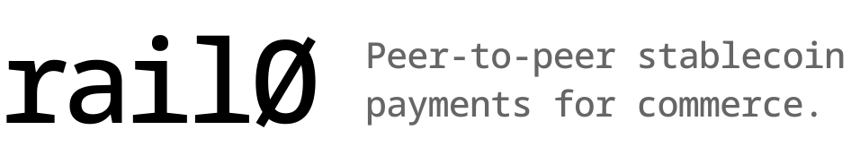

<picture>
  <source media="(prefers-color-scheme: dark)" srcset="logo/rail0_payoff_white.svg">
  
</picture>

---

The internet runs on open protocols — HTTP, DNS, SMTP — that anyone can implement, run, and build on without permission. Payments are the conspicuous exception. Online commerce today still routes through a layered stack of intermediaries (networks, processors, gateways, issuers, acquirers), each taking a fee, adding latency, and reserving the right to refuse service. Cross-border settlement is slow and expensive. Programmable money, twenty years into the API economy, is still mostly marketing.

Stablecoins are changing the substrate. A dollar can move between two wallets in under a second, anywhere in the world, for fractions of a cent, without anyone's permission. **But a transfer alone isn't commerce. Commerce needs the primitives card networks have always provided — authorization, capture, refund, dispute windows — around the bare movement of money.** So far, the only way to get those primitives has been to plug back into the legacy stack and inherit its costs.

_rail0_ is the alternative: a single immutable smart contract that implements the full authorize → capture → refund lifecycle for stablecoin payments, with no owner, no admin, no fees, and no privileged operator. It is a peer-to-peer protocol with no intermediaries: buyer and merchant transact directly, and every captured token reaches the merchant in full — the contract takes nothing and routes nothing to anyone else.

Anyone can deploy the contract. Anyone can use it. Buyer-initiated operations work like a signed check: the buyer signs a per-payment authorization off-chain, the merchant submits the transaction, and the merchant pays gas natively in the chain's stablecoin. No bundlers, no smart-account wallets required, no separate paymaster. Buyer keeps any wallet that signs typed data, merchant absorbs the cost of acceptance the way they always have under card networks. _rail0_ adds nothing between buyer and merchant beyond the rules of the contract itself — rules that are public, immutable, and the same for everyone.

Payment rails should be open like the rest of the internet. That is the mission. The zero in _rail0_ is literal: zero intermediaries between buyer and merchant, zero protocol fees, zero privileged operators, zero permission required to deploy or to use. It also marks day zero — the moment payments stop being a service rented from someone else's network and become a commodity protocol the way HTTP is. If we get this right, _rail0_ is the last payment rail the new era needs.

## Supported chains

_rail0_ has just two hard requirements — any chain and token that meet them can run it:

- **EVM-compatible.** Solidity 0.8.27 must compile and execute on the chain.
- **EIP-3009-capable tokens.** Each accepted token must expose `transferWithAuthorization` and `receiveWithAuthorization` so buyers and merchants can authorize transfers off-chain (used by `authorize`/`charge` and `refund` respectively).

Beyond those, _rail0_ is **best on stablecoin-native chains with sub-second finality**, and that's what the targeted deployments below optimize for — but neither is required by the contract:

- **Stablecoin-native gas.** When the chain's native gas token is a regulated stablecoin (USDC, USDT, EURC, etc.), merchants pay gas in the same asset they're settling in — no second gas-token to manage. On other EVM chains _rail0_ still works; the merchant just pays gas in the chain's native token.
- **Sub-second finality.** Online checkout doesn't tolerate multi-second confirmation times, so fast-finality chains give the best UX — but slower chains remain functionally supported.

Currently targeted:

| Chain | Network | Stablecoin(s) | _rail0_ address |
|-------|---------|---------------|-----------------|
| Arc | testnet | USDC, EURC | [`0xd9b5...6792`](https://testnet.arcscan.app/address/0xd9b5Be76F99EC8AE583dc1385832B2E54D406792) |
| Celo | Sepolia testnet | USDC, USDT | [`0x4CCC...311b`](https://celo-sepolia.blockscout.com/address/0x4CCC4DdeBB8A63B9186936A8C0FA404910A4311b) |
| Plasma | testnet | USDT0 | _planned_ |
| Tempo | — | TIP-20 (EIP-2612 only today) | _waiting on EIP-3009_ |

## Protocol

_rail0_ implements the authorize → capture → refund lifecycle familiar from card networks as a single immutable smart contract: buyers and merchants transact directly, the protocol never custodies payment funds outside the active escrow window, and there is no owner, no admin, no upgradeability, and no protocol fee. Buyer-funded operations use a single off-chain signature: the buyer signs an **EIP-3009 `TransferWithAuthorization`** over the token's domain and the merchant (`p.payee`) submits the transaction and pays gas natively. Every operation is merchant-submitted, with one exception — `release`, which either the payer or the payee may submit to return escrowed funds to the buyer. No allowance is granted, no separate intent typehash, no token approval — one signature, one transaction, no broadcasted setup from the buyer.

### Lifecycle

A payment moves through two sequential time windows defined by the configuration the buyer and merchant agree on up front. The payment is opened with either `authorize` (escrow funds for later capture) or `charge` (pay through immediately, no hold) — the buyer signs the intent off-chain and the merchant submits the transaction. Until `authorizationExpiry`, the merchant can `capture` the escrowed funds — partially or in full, across one or more calls — or `void` the hold and return it to the buyer; after that deadline either the payer or the payee may submit `release` to return the remaining escrow to the buyer. Captured funds stay reversible: until `refundExpiry`, the merchant can `refund` any portion back to the buyer. The expiries must satisfy `authorizationExpiry ≤ refundExpiry`. The window for opening the payment is bounded by `authorizationExpiry` itself — _rail0_ pins the buyer's EIP-3009 `validBefore` to that timestamp at submission, so a single field controls both the submission deadline and (for `authorize`) the merchant's capture window. Alongside the fund lifecycle, the buyer can raise a `dispute` against captured funds while the refund window is open — a signal-only open/close record that moves no money (see _Dispute / Close dispute_). Each operation is detailed below in lifecycle order.

#### Authorize

```solidity
function authorize(
    bytes32 paymentId,
    Payment calldata p,
    uint8 v,
    bytes32 r,
    bytes32 s
) external;
```

Buyer escrows `p.amount` of the stablecoin in the contract, holding it for the merchant to capture later.

The buyer signs an **EIP-3009 `TransferWithAuthorization`** over the token's domain with `from = p.payer`, `to = address(rail0)`, `value = p.amount`, `validAfter = 0`, `validBefore = p.authorizationExpiry`, and `nonce = keccak256(_AUTHORIZE_NONCE_PREFIX, paymentId, configHash)`. The merchant submits this transaction. The contract validates the config (expiries in order and not in the past, addresses non-zero, token in the deployment's allowlist), records the payment state, then calls `token.transferWithAuthorization(...)` with the deterministic nonce and the pinned validity window. The token's own EIP-712 sig check verifies the buyer's signature; if anything was tampered (different Payment terms, different amount, different recipient), the recovered signer won't match `p.payer` and the token reverts. The deterministic-nonce trick is what binds the buyer's signature to the exact Payment terms — no separate intent typehash needed. Once authorized, the merchant may `capture` (one or more times, partial or full up to `p.amount`) before `authorizationExpiry`, or `void` at any time. If neither happens, `release` opens after `authorizationExpiry`.

#### Charge

```solidity
function charge(
    bytes32 paymentId,
    Payment calldata p,
    uint8 v,
    bytes32 r,
    bytes32 s
) external;
```

Buyer authorizes and pays through in a single call — no escrow hold.

Same EIP-3009 pattern as `authorize` (including `validAfter = 0` and `validBefore = p.authorizationExpiry` in the signed payload), but the contract derives the nonce with `_CHARGE_NONCE_PREFIX` instead. A buyer's authorize-signature cannot be used to call `charge` (and vice versa) because the two derived nonces differ — the token would compute a different nonce when verifying and the recovered signer would not match. Preconditions are otherwise identical (fresh `paymentId`, valid Payment, current time before `authorizationExpiry`). Here `authorizationExpiry` doubles as the submission deadline only — there is no escrow window. The difference is settlement: instead of leaving funds in the contract, `charge` immediately transfers `p.amount` to `payee`. State is recorded with `capturableAmount = 0` and `refundableAmount = p.amount`, so the merchant can still issue refunds against this payment until `refundExpiry`. Use this when the merchant doesn't need a separate fulfillment window — e.g. digital goods, instant services, or any flow where there is nothing to "capture later."

#### Capture

```solidity
function capture(bytes32 paymentId, Payment calldata p, uint256 amount) external;
```

Merchant pulls funds from escrow into their wallet.

Only `p.payee` may call. Must run before `p.authorizationExpiry`, with `0 < amount ≤ capturableAmount`. State is updated atomically: `capturableAmount -= amount` and `refundableAmount += amount`, so refunds remain available against the captured slice until `refundExpiry`. The captured `amount` is sent to `payee` in full via a single ERC-20 `transfer` call — the contract takes nothing. Captures may be partial and repeated — a merchant can split a single authorization across multiple captures (e.g. as items in an order ship over time) up to `p.amount`.

#### Void

```solidity
function void(bytes32 paymentId, Payment calldata p) external;
```

Merchant cancels the authorization, returning all currently-escrowed funds to the buyer.

Only `p.payee` may call. There is no deadline — the merchant can void any time `capturableAmount > 0`. The entire remaining escrow is sent back to the buyer in a single `transfer` call, and `capturableAmount` is zeroed. Voiding has no effect on `refundableAmount` — any previously captured slices remain refundable on their own timeline. Typical use: order rejected, fraud detected, or fulfillment canceled before any capture happened.

#### Release

```solidity
function release(bytes32 paymentId, Payment calldata p) external;
```

Buyer's safety net — return escrowed funds to the buyer if the merchant never captured.

**Only the payer or the payee may call** — funds always go to `p.payer` regardless of which of the two submits, so there is no theft potential. The buyer can submit this themselves to recover their escrowed funds, or the merchant can submit it to settle. Only callable after `block.timestamp >= p.authorizationExpiry`. Returns the full remaining `capturableAmount` (all-or-nothing) and zeroes that slot. This is the buyer's only on-chain recourse if the merchant disappears — _rail0_ has no arbitration layer. Setting a sensible `authorizationExpiry` is therefore important for the buyer: it is the timestamp at which the merchant's "right to capture" ends and the buyer's "right to recover" begins.

#### Refund

```solidity
function refund(
    bytes32 paymentId,
    Payment calldata p,
    uint256 amount,
    uint8 v,
    bytes32 r,
    bytes32 s
) external;
```

Merchant reverses a prior capture, sending `amount` of the stablecoin back to the buyer.

Captured funds live in the merchant's wallet (not the contract), so `refund` pulls them back using the **same EIP-3009 pattern as `authorize`/`charge`** — symmetric, no allowance. The merchant (`p.payee`) signs an EIP-3009 `TransferWithAuthorization` over the token's domain off-chain with `from = p.payee`, `to = address(rail0)`, `value = amount`, `validAfter = 0`, `validBefore = p.refundExpiry`, and `nonce = keccak256(_REFUND_NONCE_PREFIX, paymentId, configHash, refundableAmount)`. **Only the merchant (`p.payee`)** may submit the transaction. The contract checks the caller is the payee, that the payment exists, that `block.timestamp < p.refundExpiry` and `0 < amount ≤ refundableAmount`, decrements `refundableAmount -= amount`, then calls `token.receiveWithAuthorization(...)` to pull the funds from the merchant into _rail0_ and immediately forwards them to `p.payer` via `transfer`. No ERC-20 `approve` is ever needed.

The refund nonce encodes the **current** `refundableAmount`, so each partial refund has a unique, deterministic nonce tied to the payment's state at signing time. _rail0_ always derives the nonce from the live `refundableAmount` when it calls the token, so a stale signature (made against an earlier `refundableAmount`) produces a different nonce than the one the merchant signed — the token's EIP-712 check recovers a signer that doesn't match `p.payee` and reverts. A replay of the same signed refund is rejected by the token's used-nonce tracking. Use `refundNonce(paymentId, configHash, refundableAmount)` to compute the value off-chain.

#### Dispute / Close dispute

```solidity
function dispute(bytes32 paymentId, Payment calldata p, bytes32 reason) external;
function closeDispute(bytes32 paymentId, Payment calldata p, bytes32 reason) external;
```

Buyer-driven dispute signal with an on-chain open/close lifecycle. **It has no fund effect** — opening or closing a dispute never moves, blocks, or escrows anything. It is a permanent, censorship-resistant on-chain record that the buyer is contesting a payment; off-chain systems (indexer, merchant integrations) react to it, typically by issuing a `refund`. This is the only entrypoint a buyer drives directly without an EIP-3009 signature — `dispute`/`closeDispute` are plain calls authenticated by `msg.sender`, and because they make no external calls they are **not** `nonReentrant`.

`dispute` opens a dispute. **Only the payer** may call, only while `block.timestamp < p.refundExpiry`, and only on funds the merchant actually holds (`refundableAmount > 0`) — a pure, uncaptured authorization is cancelled via `void`, never disputed (`NothingToDispute` otherwise). It reverts `AlreadyDisputed` if one is already open. It sets `disputed = true` and emits `PaymentDisputed(paymentId, payer, payee, reason)`. `reason` is a caller-supplied `bytes32` code (e.g. `keccak256(text)`); its meaning lives off-chain.

`closeDispute` withdraws an open dispute. **Only the payer** may call — the merchant cannot dismiss a buyer's dispute. The merchant's only way to close one is to actually resolve it via a **full `refund`** (one that brings `refundableAmount` to 0), which auto-closes the dispute and emits `DisputeClosed(paymentId, payer, payee, msg.sender, REASON_FULL_REFUND)` (with `closedBy = payee`). A manual withdrawal has no window restriction (the payer can clear the flag even after `refundExpiry`) and emits `DisputeClosed(paymentId, payer, payee, payer, reason)`. Reopening after a close is allowed within the refund window; each open and close emits its event, giving indexers the full history.

A dispute opened but never resolved before `refundExpiry` stays `disputed == true` permanently — like every time bound in _rail0_, `refundExpiry` is a guard, not a state transition, and there is no keeper to flip it. The frozen flag is the faithful terminal record "contested, never resolved on-chain within the window"; off-chain systems read `disputed && now ≥ refundExpiry` to interpret it.

### The `Payment` struct

A payment's terms are committed at authorization time and immutable thereafter. The struct is passed in calldata on every call and verified against a stored hash.

| Field                  | Type      | Meaning                                                          |
|------------------------|-----------|------------------------------------------------------------------|
| `payer`                | `address` | Buyer. Source of escrowed funds; signer of the EIP-3009 `TransferWithAuthorization` off-chain. |
| `payee`                | `address` | Merchant. Calls `capture`, `void`, `refund`. Recipient of captured funds. |
| `token`                | `address` | ERC-20 stablecoin. Must be in the deployment's allowlist.        |
| `amount`               | `uint120` | Exact amount the buyer commits to pay; signed as the EIP-3009 `value`. |
| `authorizationExpiry`  | `uint48`  | Cutoff for `capture`; `release` opens after this timestamp.      |
| `refundExpiry`         | `uint48`  | Cutoff for `refund`.                                             |

### State model

Per `paymentId`, the contract keeps two storage entries:

- `_state[paymentId]` — a packed slot containing `exists`, `capturableAmount`, `refundableAmount`, and `disputed`. Once `exists` is set it never resets, preventing payment-ID reuse.
- `_configHash[paymentId]` — the EIP-712 digest of the `Payment` struct, set on first call and never mutated.

`capturableAmount` is funds **held in escrow** by the contract. `refundableAmount` is funds **already paid to the merchant** that are still reversible. `capture` moves money from the first bucket to the second (and out the door to the merchant); `refund` drains the second. `disputed` is a buyer-controlled signal flag with no fund effect (see _Dispute / Close dispute_); the four fields pack into a single 256-bit storage slot, so the flag adds no extra slot cost.

### Token allowlist

Each _rail0_ deployment is constructed with a fixed list of accepted ERC-20 token addresses. Calls to `authorize`/`charge` revert with `TokenNotAccepted` if `p.token` is not in the allowlist. The allowlist is set in the constructor and **cannot be modified afterward** — adding a new stablecoin requires a new deployment.

A `TokenAccepted(address indexed token)` event is emitted from the constructor for each entry, so an indexer can reconstruct the allowlist from the deployment transaction's logs. `isAcceptedToken(address)` is a public view for the same query.

Practical implications:

- One deployment per `(chain, set of accepted tokens)`. A single deployment can accept multiple stablecoins (e.g., USDC + EURC) provided you list them at construction.
- When a chain adds a stablecoin you want to accept, deploy a new _rail0_ with the expanded list. Existing deployments continue to work for their original token set; new payments use the new deployment.
- Integrators should pin the _rail0_ address per chain and not assume cross-deployment compatibility.
- The contract is versioned (`VERSION` constant, also in the EIP-712 domain); bumping it invalidates prior signatures, so version changes also require a new deployment.

### Config commitment (EIP-712)

The `Payment` struct is hashed with EIP-712 typed-data encoding using the domain `EIP712Domain(name="RAIL0", version="1.1.0", chainId, verifyingContract)`. The digest is stored at `_configHash[paymentId]` on first call (`authorize`/`charge`) and re-checked on every subsequent call via `_loadAndVerify`. Tampering with any field causes a `PaymentMismatch` revert.

Buyer-initiated operations don't introduce a separate _rail0_-domain signing typehash. Instead, _rail0_ derives a deterministic EIP-3009 nonce from the operation context:

```solidity
authorizeNonce = keccak256(keccak256("RAIL0.AUTHORIZE"), paymentId, configHash)
chargeNonce    = keccak256(keccak256("RAIL0.CHARGE"),    paymentId, configHash)
```

The buyer signs the token's standard `TransferWithAuthorization` digest with this nonce. The merchant submits, _rail0_ recomputes the nonce from the supplied Payment, and calls `token.transferWithAuthorization(...)`. If the merchant tampered with any Payment field, the recomputed nonce differs, the recovered signer differs from `p.payer`, and the token reverts. The configHash inside the nonce derivation provides the same term-binding that an EIP-712 intent typehash would, without needing one.

Distinct prefixes ensure an authorize-signature can't be reused for charge — the nonces don't match.

The domain separator is cached at construction and rebuilt automatically if `block.chainid` changes (chain-fork safety). Helpers exposed to off-chain signers:

- `DOMAIN_SEPARATOR()` — current EIP-712 domain separator (used only for `Payment` hashing; the buyer signs over the _token's_ domain).
- `hashPayment(p)` — Payment digest (also stored on-chain as configHash).
- `authorizeNonce(paymentId, configHash)` — EIP-3009 nonce the buyer must use when signing for `authorize`.
- `chargeNonce(paymentId, configHash)` — EIP-3009 nonce the buyer must use when signing for `charge`.
- `refundNonce(paymentId, configHash, refundableAmount)` — EIP-3009 nonce the merchant must use when signing for `refund`. Encodes the current `refundableAmount`, so each partial refund has a distinct, replay-proof nonce.

### Allowance requirements

_rail0_ does not custody anything outside the active escrow window, and **no allowance grant ever happens for either party** — every wallet-to-contract movement uses an EIP-3009 signature:

- **Buyer.** EIP-3009's `transferWithAuthorization` moves funds from the buyer's wallet to _rail0_ atomically based on the buyer's signature alone (for `authorize` / `charge`). The buyer never calls `approve`, never grants an allowance, and broadcasts no transaction to fund a payment — they only sign. (The buyer may optionally broadcast `release` after `authorizationExpiry` to recover an uncaptured escrow themselves.)
- **Merchant.** Captured funds live in the merchant's wallet; `refund` pulls them back via EIP-3009 `receiveWithAuthorization` against a signature the merchant produces off-chain. The merchant never grants an allowance either. Nothing is required for `capture` / `void` / `release` (those distribute or move funds _rail0_ already holds).

### Events

Every lifecycle event — fund-moving and dispute alike — indexes `paymentId`, `payer`, and `payee`, so indexers can filter by any party without a separate join:

```solidity
event TokenAccepted(address indexed token);

event PaymentAuthorized(bytes32 indexed paymentId, address indexed payer, address indexed payee, Payment payment);
event PaymentCharged   (bytes32 indexed paymentId, address indexed payer, address indexed payee, Payment payment);
event PaymentCaptured  (bytes32 indexed paymentId, address indexed payer, address indexed payee, uint256 amount);
event PaymentVoided    (bytes32 indexed paymentId, address indexed payer, address indexed payee, uint256 amount);
event PaymentReleased  (bytes32 indexed paymentId, address indexed payer, address indexed payee, uint256 amount);
event PaymentRefunded  (bytes32 indexed paymentId, address indexed payer, address indexed payee, uint256 amount);

// Dispute signal — no fund effect. `reason` is a caller-supplied bytes32 code (meaning off-chain).
event PaymentDisputed  (bytes32 indexed paymentId, address indexed payer, address indexed payee, bytes32 reason);
event DisputeClosed    (bytes32 indexed paymentId, address indexed payer, address indexed payee, address closedBy, bytes32 reason);
```

`DisputeClosed` indexes `payer`/`payee` like every other event, so closes are filterable by party regardless of who closed them. The `closedBy` data field records the actor — the payer on a manual withdrawal, or the refund submitter (payee) on a full-refund auto-close; in the latter case `reason` is the reserved constant `REASON_FULL_REFUND` (`keccak256("rail0.dispute.full_refund")`).

To correlate token transfers with a `paymentId`, indexers join the token's `Transfer` events with _rail0_'s lifecycle events on transaction hash and log ordering — the lifecycle event always lands in the same transaction as its corresponding transfers.

### Errors

| Error                       | Cause                                                              |
|-----------------------------|--------------------------------------------------------------------|
| `NotPayee`                  | Caller is not the merchant on `authorize`/`charge`/`capture`/`void`/`refund`. |
| `NotPayer`                  | Caller is not the buyer on `dispute`/`closeDispute`.              |
| `NotPayerOrPayee`           | `release` caller is neither the payer nor the payee.              |
| `PaymentAlreadyExists`      | `paymentId` was already used.                                      |
| `PaymentNotFound`           | `paymentId` has no state.                                          |
| `PaymentMismatch`           | The `Payment` struct passed in does not match the stored hash.     |
| `InvalidAmount`             | `p.amount == 0`.                                                   |
| `InvalidExpiries`           | Expiries are zero or out of order.                                 |
| `AuthorizationExpired`      | `timestamp >= authorizationExpiry`; `authorize`/`charge`/`capture`.|
| `AuthorizationNotExpired`   | `release` called before `authorizationExpiry`.                     |
| `RefundExpired`             | `block.timestamp >= p.refundExpiry` at refund.                     |
| `ZeroAddress`               | `payer`, `payee`, or `token` is the zero address.                  |
| `InvalidCaptureAmount`      | `amount == 0` or `amount > capturableAmount`.                      |
| `InvalidRefundAmount`       | `amount == 0` or `amount > refundableAmount`.                      |
| `NothingToVoid`             | `void` called with `capturableAmount == 0`.                        |
| `NothingToRelease`          | `release` called with `capturableAmount == 0`.                     |
| `NothingToDispute`          | `dispute` called with `refundableAmount == 0` (nothing the merchant holds). |
| `AlreadyDisputed`           | `dispute` called while a dispute is already open.                 |
| `NotDisputed`               | `closeDispute` called with no open dispute.                        |
| `TokenNotAccepted`          | `p.token` is not in the deployment's allowlist.                    |
| `DuplicateToken`            | Constructor `acceptedTokens` contained the same address twice.     |
| `TransferFailed`            | A token `transfer` returned `false` or reverted.                   |
| `Reentrancy`                | A nested call attempted to reenter a guarded entrypoint.           |

### Security model

- **No privileged roles.** No owner, no pauser, no upgrade path. The contract code is fixed at deploy time. The token allowlist is set in the constructor and immutable thereafter.
- **Curated trust boundary.** The deployer chooses which tokens _rail0_ will process. Including a hostile or weird ERC-20 in the allowlist is the deployer's risk to manage — the contract trusts allowlisted tokens to behave like standard ERC-20s.
- **Reentrancy guard.** Every entrypoint that makes an external token call (`authorize`, `charge`, `capture`, `void`, `release`, `refund`) is protected by a `nonReentrant` modifier; any attempt to reenter from inside a token call reverts with `Reentrancy`. `dispute` and `closeDispute` make no external calls and hold no `nonReentrant` modifier by design — the only fund-moving dispute path is the full-refund auto-close, which executes inside `refund`'s effects phase, already under its guard and ahead of any transfer.
- **Checks-Effects-Interactions.** All state mutations occur before external transfers. Even if the reentrancy guard were bypassed (it can't be) the CEI ordering already prevents same-payment double-spending.
- **SafeERC20-style transfers.** `_safeTransfer` accepts both bool-returning and non-returning ERC-20 implementations, and reverts with `TransferFailed` on any failure. Compatible with USDT-mainnet-style tokens that don't return a value. Inbound pulls from buyer and merchant use EIP-3009 (`transferWithAuthorization` / `receiveWithAuthorization`), which revert on the token side if the signature is invalid.
- **Frozen-merchant escape hatch.** If the merchant is frozen by the token issuer (e.g., USDC blacklist) after authorization, `capture` reverts because the contract cannot deliver funds to `payee`. The buyer's escrowed funds are not stuck: `void` (anytime, by the merchant) and `release` (after `authorizationExpiry`, by the payer or payee) send funds directly to the buyer, so they always have a recovery path.
- **Merchant refund-window exposure.** `refundExpiry` has no upper bound, and it is the `validBefore` pinned into the merchant's EIP-3009 refund signature — a signed-but-unsubmitted refund stays valid until that deadline. No standing allowance is held (refunds use a per-refund signature, not `approve`), so there is no idle-allowance risk. Still, best practice is to set bounded refund windows aligned with consumer-protection requirements (typically 14–30 days), not to set `refundExpiry` to the far future.
- **Caller-supplied `paymentId`.** The contract enforces uniqueness (`PaymentAlreadyExists`) but does not generate IDs. Integrators should use a collision-resistant scheme (UUID, `keccak256(payer, payee, nonce)`, etc.).
- **Time-based fund recourse only; disputes are signal, not arbitration.** The protocol has no arbitration layer: the only on-chain mechanism that moves funds back to the buyer is `release` after `authorizationExpiry` (for uncaptured escrow) and the merchant's discretionary `refund` (for captured funds). The `dispute`/`closeDispute` lifecycle adds a censorship-resistant on-chain record that the buyer is contesting a payment, but it has **no fund effect** — it cannot force, block, or move money. The contract enforces only the mechanical invariants of the lifecycle (payer-only open and withdraw, within the refund window, one open dispute at a time, payee-closes-only-via-full-refund); it has **no anti-abuse controls** (no rate-limit, reputation, or velocity checks), since it is immutable, permissionless, and has no identity primitives. Because a dispute carries no financial payoff, friendly-fraud abuse is structurally neutralized on-chain; detection and reaction (analytics, velocity limits, blocklists, the charge-vs-authorize lever, evidence correlation) belong off-chain in the indexer and merchant integrations.
- **Test coverage.** A 99-test Foundry suite (`contracts/test/RAIL0.t.sol`) covers the full lifecycle, allowlist construction, every revert path on every entrypoint (`PaymentNotFound`, `PaymentMismatch`, `NotPayee`, `NotPayer`, `NotPayerOrPayee`, all amount/expiry validation), submitter-authorization gates (payee-only on `authorize`/`charge`/`capture`/`void`/`refund`; payer-or-payee on `release`; payer-only on `dispute`/`closeDispute`), the dispute open/close lifecycle (open within window, `NothingToDispute` on uncaptured funds, `AlreadyDisputed`, reopen-after-close, payer-only withdrawal with payee/stranger rejected, withdrawal allowed past `refundExpiry`, full-refund auto-close, partial refund keeps the dispute open, no spurious `DisputeClosed`, and funds untouched by open/close), EIP-712 hashing determinism, EIP-3009 nonce derivation and signature verification (wrong signer, tampered amount, tampered Payment, submission after `authorizationExpiry`, wrong nonce prefix, paymentId-replay protection), `_safeTransfer` failure handling on bool=false-returning tokens, boundary conditions (equal expiries, exact authorizationExpiry), and reentrancy attempts via a malicious mock token. No external audit has been performed.

### Limits

- Per-payment amounts are capped at `type(uint120).max` (≈ 1.3 × 10³⁶, or 1.3 × 10³⁰ at 6 decimals — effectively unbounded for stablecoins).
- An authorization cannot be topped up or extended; needing more requires a new `paymentId`.
- `release` and `void` are all-or-nothing — they always return the entire remaining `capturableAmount` to the buyer.
- `paymentId` slots are never deleted; reusing an ID always reverts. State grows monotonically with the number of distinct payments (~64 bytes per payment). The contract is immutable, so future state-expiry / pruning EIPs cannot be retrofitted — _rail0_ assumes its host chain prices state acceptably.
- The token allowlist is fixed at deployment; new stablecoins require a new deployment.

## Examples

End-to-end `cast` recipes for every workflow. Examples use `--private-key` for readability — in production, prefer `cast wallet import <name>` once and then `--account <name>` on each command (never put long-lived keys on the command line).

### Setup

Set the addresses and keys you'll reuse:

```sh
export RPC=https://rpc.example.network
export RAIL0=0x...                  # the _rail0_ deployment
export TOKEN=0x...                  # an accepted stablecoin
export PAYER=0x...                  # buyer wallet
export PAYEE=0x...                  # merchant wallet
export PAYER_KEY=0x...              # buyer signing key (signs EIP-3009 TransferWithAuthorization off-chain)
export PAYEE_KEY=0x...              # merchant signing key (submits txs)
```

The `Payment` struct is a 6-field tuple. Define it once and reuse:

```sh
export AMOUNT=100000000             # 100 USDC at 6 decimals — exact amount the buyer commits to pay
export AUTH_EXPIRY=1736294400       # authorize-by / capture-by deadline (Unix seconds)
export REFUND_EXPIRY=1738972800     # refund-by deadline (Unix seconds)

# (payer, payee, token, amount, authorizationExpiry, refundExpiry)
export PAYMENT="($PAYER,$PAYEE,$TOKEN,$AMOUNT,$AUTH_EXPIRY,$REFUND_EXPIRY)"
export PAYMENT_TYPE='(address,address,address,uint120,uint48,uint48)'
export PAYMENT_ID=$(cast keccak "order-12345")
```

### Authorize (buyer signs EIP-3009, merchant submits)

The buyer signs an EIP-3009 `TransferWithAuthorization` over the token's domain. The merchant submits and pays gas. In production a wallet SDK handles the EIP-712 signing; the cast equivalent below builds the digest manually.

```sh
# 1. Compute the deterministic EIP-3009 nonce that _rail0_ expects
CONFIG_HASH=$(cast call $RAIL0 "hashPayment($PAYMENT_TYPE)(bytes32)" "$PAYMENT" --rpc-url $RPC)
NONCE=$(cast call $RAIL0 "authorizeNonce(bytes32,bytes32)(bytes32)" \
  $PAYMENT_ID $CONFIG_HASH --rpc-url $RPC)

# 2. Build the EIP-3009 TransferWithAuthorization digest (over the TOKEN's domain).
#    _rail0_ pins the EIP-3009 validity window — validAfter is always 0 and
#    validBefore is always p.authorizationExpiry — so the 5th and 6th args below
#    must be exactly 0 and $AUTH_EXPIRY or _rail0_'s call to the token will reject
#    the signature. The `value` field is $AMOUNT (= p.amount in $PAYMENT).
TOKEN_DOMAIN=$(cast call $TOKEN "DOMAIN_SEPARATOR()(bytes32)" --rpc-url $RPC)
TWA_TYPEHASH=$(cast keccak \
  "TransferWithAuthorization(address from,address to,uint256 value,uint256 validAfter,uint256 validBefore,bytes32 nonce)")
STRUCT_HASH=$(cast keccak $(cast abi-encode \
  "f(bytes32,address,address,uint256,uint256,uint256,bytes32)" \
  $TWA_TYPEHASH $PAYER $RAIL0 $AMOUNT 0 $AUTH_EXPIRY $NONCE))
DIGEST=$(cast keccak 0x1901${TOKEN_DOMAIN:2}${STRUCT_HASH:2})

# 3. Buyer signs the raw digest
SIG=$(cast wallet sign --no-hash --private-key $PAYER_KEY $DIGEST)

# 4. Split into v, r, s for the call
R=0x${SIG:2:64}
S=0x${SIG:66:64}
V=0x${SIG:130:2}

# 5. Merchant submits the transaction and pays gas — amount lives inside $PAYMENT,
#    so it is not passed separately.
cast send $RAIL0 \
  "authorize(bytes32,$PAYMENT_TYPE,uint8,bytes32,bytes32)" \
  $PAYMENT_ID "$PAYMENT" $V $R $S \
  --rpc-url $RPC --private-key $PAYEE_KEY
```

In production, the buyer's wallet (MetaMask, Rabby, hardware) renders this as a standard EIP-3009 `TransferWithAuthorization` prompt and signs via `eth_signTypedData_v4`. No separate intent typehash is needed — the deterministic nonce binds the signature to the Payment terms.

### Capture (merchant)

```sh
# Full capture
cast send $RAIL0 "capture(bytes32,$PAYMENT_TYPE,uint256)" \
  $PAYMENT_ID "$PAYMENT" 100000000 \
  --rpc-url $RPC --private-key $PAYEE_KEY

# Partial capture (can be called multiple times up to original amount)
cast send $RAIL0 "capture(bytes32,$PAYMENT_TYPE,uint256)" \
  $PAYMENT_ID "$PAYMENT" 30000000 \
  --rpc-url $RPC --private-key $PAYEE_KEY
```

### Refund (merchant signs EIP-3009 and submits)

Pulls from the merchant's own wallet back to the buyer using the same EIP-3009 pattern as Authorize — no allowance, no `approve`. The merchant signs a `TransferWithAuthorization` over the token's domain with `from = $PAYEE`, `to = $RAIL0`, `value` = the refund amount, `validAfter = 0`, `validBefore = $REFUND_EXPIRY`, and the nonce from `refundNonce`, then submits it (only `p.payee` may submit).

```sh
# 1. Compute the refund nonce for the CURRENT refundable balance.
#    refundableAmount comes from the payment state (here: a full 50000000 refund).
NONCE=$(cast call $RAIL0 "refundNonce(bytes32,bytes32,uint120)(bytes32)" \
  $PAYMENT_ID $CONFIG_HASH 50000000 --rpc-url $RPC)

# 2. Build the EIP-3009 TransferWithAuthorization digest over the TOKEN's domain.
#    value = 50000000, validAfter = 0, validBefore = $REFUND_EXPIRY.
STRUCT_HASH=$(cast keccak $(cast abi-encode \
  "f(bytes32,address,address,uint256,uint256,uint256,bytes32)" \
  $TWA_TYPEHASH $PAYEE $RAIL0 50000000 0 $REFUND_EXPIRY $NONCE))
DIGEST=$(cast keccak 0x1901${TOKEN_DOMAIN:2}${STRUCT_HASH:2})

# 3. Merchant signs; split into v, r, s.
SIG=$(cast wallet sign --no-hash --private-key $PAYEE_KEY $DIGEST)
R=0x${SIG:2:64}; S=0x${SIG:66:64}; V=0x${SIG:130:2}

# 4. Merchant submits — funds always reach $PAYER.
cast send $RAIL0 "refund(bytes32,$PAYMENT_TYPE,uint256,uint8,bytes32,bytes32)" \
  $PAYMENT_ID "$PAYMENT" 50000000 $V $R $S \
  --rpc-url $RPC --private-key $PAYEE_KEY
```

### Charge (buyer signs EIP-3009, merchant submits — one-shot pay-through)

Skip escrow; pay merchant immediately. Refunds remain available until `refundExpiry`. Identical pattern to Authorize but the buyer derives the nonce with `chargeNonce` instead of `authorizeNonce` (so an authorize-signature can't be repurposed for charge):

```sh
NONCE=$(cast call $RAIL0 "chargeNonce(bytes32,bytes32)(bytes32)" \
  $PAYMENT_ID $CONFIG_HASH --rpc-url $RPC)

# Build digest with the new nonce, sign, split, then:
cast send $RAIL0 \
  "charge(bytes32,$PAYMENT_TYPE,uint8,bytes32,bytes32)" \
  $PAYMENT_ID "$PAYMENT" $V $R $S \
  --rpc-url $RPC --private-key $PAYEE_KEY
```

### Void (merchant cancels authorization)

Returns all currently-escrowed funds to the buyer. No deadline.

```sh
cast send $RAIL0 "void(bytes32,$PAYMENT_TYPE)" \
  $PAYMENT_ID "$PAYMENT" \
  --rpc-url $RPC --private-key $PAYEE_KEY
```

### Release (payer or payee — after authorizationExpiry)

After `authorizationExpiry`, if no capture happened, the payer or the payee can submit `release` and the funds go to `p.payer`:

```sh
# Either the buyer (payer) or the merchant (payee) key works
cast send $RAIL0 "release(bytes32,$PAYMENT_TYPE)" \
  $PAYMENT_ID "$PAYMENT" \
  --rpc-url $RPC --private-key $PAYER_KEY
```

### Reading state

Payment state (returns `(bool exists, uint120 capturable, uint120 refundable)`):

```sh
cast call $RAIL0 "getPaymentState(bytes32)((bool,uint120,uint120))" \
  $PAYMENT_ID --rpc-url $RPC
```

Stored config hash:

```sh
cast call $RAIL0 "getConfigHash(bytes32)(bytes32)" \
  $PAYMENT_ID --rpc-url $RPC
```

Compute the digests and nonces the contract uses:

```sh
# Payment EIP-712 digest (matches getConfigHash after authorize)
cast call $RAIL0 "hashPayment($PAYMENT_TYPE)(bytes32)" "$PAYMENT" --rpc-url $RPC

# EIP-3009 nonce for an `authorize` call
cast call $RAIL0 "authorizeNonce(bytes32,bytes32)(bytes32)" \
  $PAYMENT_ID $CONFIG_HASH --rpc-url $RPC

# EIP-3009 nonce for a `charge` call
cast call $RAIL0 "chargeNonce(bytes32,bytes32)(bytes32)" \
  $PAYMENT_ID $CONFIG_HASH --rpc-url $RPC
```

Domain separator and allowlist check:

```sh
cast call $RAIL0 "DOMAIN_SEPARATOR()(bytes32)" --rpc-url $RPC
cast call $RAIL0 "isAcceptedToken(address)(bool)" $TOKEN --rpc-url $RPC
```

## Development

The contract lives at `contracts/src/RAIL0.sol`. The Foundry workspace is rooted at `contracts/`.

### Prerequisites

- [Foundry](https://book.getfoundry.sh/) (`forge`, `cast`, `anvil`)

### Cloning

The repo uses `forge-std` as a git submodule, so clone with `--recurse-submodules` (or run `git submodule update --init --recursive` after cloning).

### Build & test

```sh
cd contracts
forge build
forge test
```

The test suite (`contracts/test/RAIL0.t.sol`) is self-contained — it includes mock ERC-20 implementations for the standard EIP-3009 case, transfer-fails, transferFrom-fails, and reentrant cases, so no fork or RPC is needed.

### Deployment

A Foundry deploy script lives at `contracts/script/Deploy.s.sol`. The token allowlist is read from `RAIL0_ACCEPTED_TOKENS` (comma-separated, no spaces) and is **immutable** after deployment — list every stablecoin this deployment should accept up front.

```sh
cast wallet import deployer --interactive          # one-time, prompts for key
export RAIL0_ACCEPTED_TOKENS=0x...,0x...

forge script script/Deploy.s.sol \
  --rpc-url $RPC \
  --account deployer \
  --broadcast
```

See `contracts/.env.example` for the full set of environment variables.

### Layout

```
contracts/
├── foundry.toml
├── src/
│   ├── RAIL0.sol                  # the protocol contract
│   └── interfaces/
│       └── IERC20.sol             # IERC20 + IEIP3009 (TransferWithAuthorization)
├── script/
│   └── Deploy.s.sol               # deploy script (reads RAIL0_ACCEPTED_TOKENS)
└── test/
    └── RAIL0.t.sol                # full test suite (lifecycle + meta-tx auth + reentrancy)
```

## License

MIT — see [LICENSE](LICENSE).
