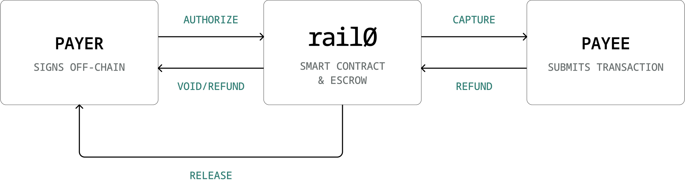

<picture>
  <source media="(prefers-color-scheme: dark)" srcset="docs/assets/rail0_payoff_white.svg">
  
</picture>

A single immutable smart contract implementing the full **authorize → capture → refund**
lifecycle for stablecoin payments — no owner, no admin, no fees, no privileged operator.

[**rail0.xyz**](https://rail0.xyz) · [Protocol](#protocol) · [Examples](#examples) · [Development](#development)

---

_rail0_ is a peer-to-peer protocol: buyer (`payer`) and merchant (`payee`) transact directly, with no processor, gateway, or operator in between. The contract custodies nothing outside the active escrow window, takes no fee, and routes every captured token to the merchant in full. It is immutable and permissionless — anyone can deploy it, anyone can use it. Buyer-funded operations need a single off-chain signature (an **EIP-3009 `TransferWithAuthorization`**); the merchant submits the transaction and pays gas. No allowance, no separate intent typehash, no smart-account wallet, no bundler.

<br>
<br>

<div align="center">
  
</div>

## At a glance

- **One immutable contract.** No owner, admin, pauser, or upgrade path. Code and token allowlist are fixed at deploy time.
- **No protocol fee.** Every captured token reaches the merchant in full; the contract routes nothing to anyone else.
- **One signature, no allowance.** Buyers sign an EIP-3009 `TransferWithAuthorization` off-chain; merchants submit and pay gas. No `approve`, no standing allowance for either party.
- **Card-network primitives on-chain.** `authorize → capture → refund`, plus `charge`, `void`, `release`, and a signal-only `dispute`.
- **Time-based recourse only.** `release` (after `authorizationExpiry`) and the merchant's discretionary `refund` are the only paths that return funds to the buyer; there is no arbitration layer.
- **Portable.** Runs on any EVM that compiles Solidity 0.8.27 with EIP-3009-capable tokens.

## Supported chains

_rail0_ has two hard requirements — any chain and token that meet them can run it:

- **EVM-compatible.** Solidity 0.8.27 must compile and execute on the chain.
- **EIP-3009-capable tokens.** Each accepted token must expose `transferWithAuthorization` and `receiveWithAuthorization` (used by `authorize`/`charge` and `refund` respectively).

Beyond those, _rail0_ is **best on stablecoin-native chains with sub-second finality** — there the merchant pays gas in the asset being settled and checkout confirms instantly — but neither is required; on any other EVM chain gas is simply paid in that chain's native token.

| Chain     | Network         | Stablecoin(s) | Status            | _rail0_ address |
|-----------|-----------------|---------------|-------------------|-----------------|
| Arbitrum  | Mainnet         | USDC          | Planned           | — |
| Arc       | Testnet         | USDC, EURC    | **Live**          | [`0x8416…C16e`](https://testnet.arcscan.app/address/0x841608e9cB4D62607D3b1d2617aF67025C30C16e) |
| Avalanche | Mainnet         | USDC, EURC    | Planned           | — |
| Base      | Mainnet         | USDC, EURC    | Planned           | — |
| Celo      | Sepolia testnet | USDC, USDT    | **Live**          | [`0x58E1…2De2`](https://celo-sepolia.blockscout.com/address/0x58E1A21F6d34e9F9Ecc441B8079befd0ff892De2) |
| Ethereum  | Mainnet         | USDC, EURC    | Planned           | — |
| Optimism  | Mainnet         | USDC          | Planned           | — |
| Plasma    | Testnet         | USDT0         | Planned           | — |
| Polygon   | Mainnet         | USDC          | Planned           | — |
| Tempo     | —               | TIP-20        | Awaiting EIP-3009 | — |

Integrators should pin the _rail0_ address per chain and not assume cross-deployment compatibility.

## Protocol

A payment moves through two sequential time windows defined by the configuration the buyer and merchant agree on up front. It is opened with either `authorize` (escrow funds for later capture) or `charge` (pay through immediately, no hold) — the buyer signs the intent off-chain and the merchant submits.

- Until **`authorizationExpiry`**, the merchant can `capture` the escrowed funds — partially or in full, across one or more calls — or, while nothing has been captured yet, `void` the hold and return it to the buyer.
- After **`authorizationExpiry`**, either the payer or the payee may submit `release` to return the remaining escrow to the buyer.
- Until **`refundExpiry`**, the merchant can `refund` any captured portion back to the buyer.
- While the refund window is open, the buyer can raise a `dispute` against captured funds — a signal-only open/close record that moves no money.

The expiries must satisfy `authorizationExpiry ≤ refundExpiry`. The window for opening the payment is bounded by `authorizationExpiry` itself — _rail0_ pins the buyer's EIP-3009 `validBefore` to that timestamp at submission, so one field controls both the submission deadline and (for `authorize`) the merchant's capture window. Every operation is merchant-submitted, with one exception: `release`, which either the payer or the payee may submit.

### Lifecycle

#### Authorize

```solidity
function authorize(bytes32 paymentId, Payment calldata p, uint8 v, bytes32 r, bytes32 s) external;
```

Buyer escrows `p.amount` of the stablecoin in the contract, holding it for the merchant to capture later.

The buyer signs an **EIP-3009 `TransferWithAuthorization`** over the token's domain with `from = p.payer`, `to = address(rail0)`, `value = p.amount`, `validAfter = 0`, `validBefore = p.authorizationExpiry`, and `nonce = keccak256(_AUTHORIZE_NONCE_PREFIX, paymentId, configHash)`. The merchant submits. The contract validates the config (expiries in order and not in the past, addresses non-zero, payer and payee distinct, token allowlisted), records the payment state, then calls `token.transferWithAuthorization(...)` with the deterministic nonce and pinned validity window. The token's own EIP-712 check verifies the signature; if any Payment term was tampered, the recovered signer won't match `p.payer` and the token reverts. The deterministic nonce is what binds the buyer's signature to the exact terms — no separate intent typehash needed. Once authorized, the merchant may `capture` (one or more times, up to `p.amount`) before `authorizationExpiry`, or `void` the hold — but only while nothing has been captured yet; otherwise `release` opens after `authorizationExpiry`.

#### Charge

```solidity
function charge(bytes32 paymentId, Payment calldata p, uint8 v, bytes32 r, bytes32 s) external;
```

Buyer authorizes and pays through in a single call — no escrow hold.

Same EIP-3009 pattern as `authorize` (including `validAfter = 0` and `validBefore = p.authorizationExpiry`), but the nonce is derived with `_CHARGE_NONCE_PREFIX`. An authorize-signature cannot be reused for `charge` (and vice versa) because the derived nonces differ. Here `authorizationExpiry` doubles only as the submission deadline — there is no escrow window. Instead of leaving funds in the contract, `charge` immediately transfers `p.amount` to `payee`. State is recorded with `capturableAmount = 0` and `refundableAmount = p.amount`, so refunds remain available until `refundExpiry`. Use this when there is nothing to capture later — digital goods, instant services, etc.

#### Capture

```solidity
function capture(bytes32 paymentId, Payment calldata p, uint256 amount) external;
```

Merchant pulls funds from escrow into their wallet.

Only `p.payee` may call. Must run before `p.authorizationExpiry`, with `0 < amount ≤ capturableAmount`. State updates atomically: `capturableAmount -= amount`, `refundableAmount += amount`, so refunds remain available against the captured slice until `refundExpiry`. The captured `amount` is sent to `payee` in full via a single ERC-20 `transfer`. Captures may be partial and repeated up to `p.amount`.

#### Void

```solidity
function void(bytes32 paymentId, Payment calldata p) external;
```

Merchant cancels the authorization, returning all currently-escrowed funds to the buyer.

Only `p.payee` may call, and only while the authorization is fully intact — **no amount has been captured yet** (`capturableAmount == p.amount`). There is no deadline within that constraint. The entire escrow is sent back to the buyer in a single `transfer` call, and `capturableAmount` is zeroed. Once any (even partial) capture has occurred, void reverts `AlreadyCaptured` — a partly-captured authorization can no longer be cancelled, and the buyer recovers the uncaptured remainder via `release` after `authorizationExpiry` instead. `void` reverts `NothingToVoid` when there is no escrow at all. Typical use: order rejected, fraud detected, or fulfillment canceled before any capture happened.

#### Release

```solidity
function release(bytes32 paymentId, Payment calldata p) external;
```

Buyer's safety net — return escrowed funds to the buyer if the merchant never captured.

**Only the payer or the payee may call** — funds always go to `p.payer` regardless of which submits, so there is no theft potential. Only callable after `block.timestamp >= p.authorizationExpiry`. Returns the full remaining `capturableAmount` (all-or-nothing) and zeroes that slot. This is the buyer's only on-chain recourse if the merchant disappears — _rail0_ has no arbitration layer, so setting a sensible `authorizationExpiry` matters: it is the timestamp at which the merchant's right to capture ends and the buyer's right to recover begins.

#### Refund

```solidity
function refund(bytes32 paymentId, Payment calldata p, uint256 amount, uint8 v, bytes32 r, bytes32 s) external;
```

Merchant reverses a prior capture, sending `amount` of the stablecoin back to the buyer.

Captured funds live in the merchant's wallet (not the contract), so `refund` pulls them back using the **same EIP-3009 pattern as `authorize`/`charge`** — symmetric, no allowance. The merchant (`p.payee`) signs an EIP-3009 `TransferWithAuthorization` with `from = p.payee`, `to = address(rail0)`, `value = amount`, `validAfter = 0`, `validBefore = p.refundExpiry`, and `nonce = keccak256(_REFUND_NONCE_PREFIX, paymentId, configHash, refundableAmount)`. **Only `p.payee`** may submit. The contract checks the caller, that the payment exists, that `block.timestamp < p.refundExpiry` and `0 < amount ≤ refundableAmount`, decrements `refundableAmount -= amount`, then calls `token.receiveWithAuthorization(...)` to pull funds from the merchant into _rail0_ and immediately forwards them to `p.payer`.

The refund nonce encodes the **current** `refundableAmount`, so each partial refund has a unique, deterministic nonce. A stale signature (made against an earlier `refundableAmount`) produces a different nonce than the one the merchant signed — the token recovers a mismatched signer and reverts. Use `refundNonce(paymentId, configHash, refundableAmount)` to compute it off-chain.

#### Dispute / Close dispute

```solidity
function dispute(bytes32 paymentId, Payment calldata p, bytes32 reason) external;
function closeDispute(bytes32 paymentId, Payment calldata p, bytes32 reason) external;
```

Buyer-driven dispute signal with an on-chain open/close lifecycle. **It has no fund effect** — opening or closing a dispute never moves, blocks, or escrows anything. It is a permanent, censorship-resistant on-chain record that the buyer is contesting a payment; off-chain systems react to it, typically by issuing a `refund`. These are the only entrypoints a buyer drives directly without an EIP-3009 signature — plain calls authenticated by `msg.sender`, and because they make no external calls they are **not** `nonReentrant`.

`dispute` opens a dispute. **Only the payer** may call, only while `block.timestamp < p.refundExpiry`, and only on funds the merchant actually holds (`refundableAmount > 0`; a pure uncaptured authorization is cancelled via `void`, never disputed — `NothingToDispute` otherwise). Reverts `AlreadyDisputed` if one is already open. Sets `disputed = true` and emits `PaymentDisputed(paymentId, payer, payee, reason)`. `reason` is a caller-supplied `bytes32` code whose meaning lives off-chain.

`closeDispute` withdraws an open dispute. **Only the payer** may call — the merchant cannot dismiss a buyer's dispute; its only way to close one is a **full `refund`** (bringing `refundableAmount` to 0), which auto-closes the dispute and emits `DisputeClosed(..., closedBy = payee, REASON_FULL_REFUND)`. A manual withdrawal has no window restriction and emits `DisputeClosed(..., closedBy = payer, reason)`. Reopening within the refund window is allowed; each open and close emits its event.

A dispute opened but never resolved before `refundExpiry` stays `disputed == true` permanently — like every time bound in _rail0_, `refundExpiry` is a guard, not a state transition. Off-chain systems read `disputed && now ≥ refundExpiry` to interpret it as "contested, never resolved on-chain within the window."

### The `Payment` struct

A payment's terms are committed at authorization time and immutable thereafter. The struct is passed in calldata on every call and verified against a stored hash.

| Field                  | Type      | Meaning                                                          |
|------------------------|-----------|------------------------------------------------------------------|
| `payer`                | `address` | Buyer. Source of escrowed funds; signer of the EIP-3009 authorization. |
| `payee`                | `address` | Merchant. Calls `capture`, `void`, `refund`. Recipient of captured funds. |
| `token`                | `address` | ERC-20 stablecoin. Must be in the deployment's allowlist.        |
| `amount`               | `uint120` | Exact amount the buyer commits to pay; signed as the EIP-3009 `value`. |
| `authorizationExpiry`  | `uint48`  | Cutoff for `capture`; `release` opens after this timestamp.      |
| `refundExpiry`         | `uint48`  | Cutoff for `refund`.                                             |

### State model

Per `paymentId`, the contract keeps two storage entries:

- `_state[paymentId]` — a packed slot containing `exists`, `capturableAmount`, `refundableAmount`, and `disputed`. Once `exists` is set it never resets, preventing payment-ID reuse.
- `_configHash[paymentId]` — the EIP-712 digest of the `Payment` struct, set on first call and never mutated.

`capturableAmount` is funds **held in escrow** by the contract. `refundableAmount` is funds **already paid to the merchant** that are still reversible. `capture` moves money from the first bucket to the second (and out to the merchant); `refund` drains the second. `disputed` is a buyer-controlled signal flag with no fund effect. All four fields pack into a single 256-bit slot, so the flag adds no extra storage cost.

### Token allowlist

Each deployment is constructed with a fixed list of accepted ERC-20 token addresses. `authorize`/`charge` revert with `TokenNotAccepted` if `p.token` is not in the allowlist. The allowlist is set in the constructor and **cannot be modified afterward** — adding a new stablecoin requires a new deployment.

A `TokenAccepted(address indexed token)` event is emitted from the constructor for each entry, so an indexer can reconstruct the allowlist from the deployment transaction's logs. `isAcceptedToken(address)` is a public view for the single-token query, and `acceptedTokens()` returns the full allowlist in constructor order for enumeration (e.g. off-chain config sync).

- One deployment per `(chain, set of accepted tokens)`. A single deployment can accept multiple stablecoins (e.g. USDC + EURC) if listed at construction.
- The contract is versioned (`VERSION` constant, also in the EIP-712 domain); bumping it invalidates prior signatures, so version changes also require a new deployment.

### Config commitment (EIP-712)

The `Payment` struct is hashed with EIP-712 typed-data encoding using the domain `EIP712Domain(name="RAIL0", version="1.2.2", chainId, verifyingContract)`. The digest is stored at `_configHash[paymentId]` on first call (`authorize`/`charge`) and re-checked on every subsequent call via `_loadAndVerify`. Tampering with any field causes a `PaymentMismatch` revert.

Buyer-initiated operations don't introduce a separate _rail0_-domain signing typehash. Instead, _rail0_ derives a deterministic EIP-3009 nonce from the operation context:

```solidity
authorizeNonce = keccak256(keccak256("RAIL0.AUTHORIZE"), paymentId, configHash)
chargeNonce    = keccak256(keccak256("RAIL0.CHARGE"),    paymentId, configHash)
```

The buyer signs the token's standard `TransferWithAuthorization` digest with this nonce; _rail0_ recomputes the nonce from the supplied Payment and calls the token. Tamper with any field and the recomputed nonce differs, the recovered signer differs from `p.payer`, and the token reverts. The `configHash` inside the nonce provides the same term-binding an EIP-712 intent typehash would, without needing one. Distinct prefixes ensure an authorize-signature can't be reused for charge.

The domain separator is cached at construction and rebuilt automatically if `block.chainid` changes (chain-fork safety). Helpers exposed to off-chain signers:

- `DOMAIN_SEPARATOR()` — current EIP-712 domain separator (for `Payment` hashing; the buyer signs over the _token's_ domain).
- `hashPayment(p)` — Payment digest (also stored on-chain as configHash).
- `authorizeNonce(paymentId, configHash)` / `chargeNonce(paymentId, configHash)` — EIP-3009 nonces for `authorize` / `charge`.
- `refundNonce(paymentId, configHash, refundableAmount)` — EIP-3009 nonce for `refund`; encodes the current `refundableAmount`, so each partial refund has a distinct, replay-proof nonce.

### Allowance requirements

_rail0_ does not custody anything outside the active escrow window, and **no allowance grant ever happens for either party** — every wallet-to-contract movement uses an EIP-3009 signature:

- **Buyer.** `transferWithAuthorization` moves funds from the buyer's wallet to _rail0_ atomically based on the signature alone (for `authorize` / `charge`). The buyer never calls `approve` and broadcasts no transaction to fund a payment — they only sign. (They may optionally broadcast `release` after `authorizationExpiry`.)
- **Merchant.** Captured funds live in the merchant's wallet; `refund` pulls them back via `receiveWithAuthorization` against a signature the merchant produces off-chain. Nothing is required for `capture` / `void` / `release` (those distribute funds _rail0_ already holds).

### Events

Every lifecycle event — fund-moving and dispute alike — indexes `paymentId`, `payer`, and `payee`, so indexers can filter by any party without a separate join:

```solidity
event TokenAccepted(address indexed token);

event PaymentAuthorized(bytes32 indexed paymentId, address indexed payer, address indexed payee, Payment payment);
event PaymentCharged   (bytes32 indexed paymentId, address indexed payer, address indexed payee, Payment payment);
event PaymentCaptured  (bytes32 indexed paymentId, address indexed payer, address indexed payee, uint256 amount);
event PaymentVoided    (bytes32 indexed paymentId, address indexed payer, address indexed payee, uint256 amount);
event PaymentReleased  (bytes32 indexed paymentId, address indexed payer, address indexed payee, uint256 amount);
event PaymentRefunded  (bytes32 indexed paymentId, address indexed payer, address indexed payee, uint256 amount);

// Dispute signal — no fund effect. `reason` is a caller-supplied bytes32 code (meaning off-chain).
event PaymentDisputed  (bytes32 indexed paymentId, address indexed payer, address indexed payee, bytes32 reason);
event DisputeClosed    (bytes32 indexed paymentId, address indexed payer, address indexed payee, address closedBy, bytes32 reason);
```

`DisputeClosed` records the actor in `closedBy` — the payer on a manual withdrawal, or the refund submitter (payee) on a full-refund auto-close; in the latter case `reason` is the reserved constant `REASON_FULL_REFUND` (`keccak256("rail0.dispute.full_refund")`). To correlate token transfers with a `paymentId`, indexers join the token's `Transfer` events with _rail0_'s lifecycle events on transaction hash and log ordering.

### Errors

| Error                       | Cause                                                              |
|-----------------------------|--------------------------------------------------------------------|
| `NotPayee`                  | Caller is not the merchant on `authorize`/`charge`/`capture`/`void`/`refund`. |
| `NotPayer`                  | Caller is not the buyer on `dispute`/`closeDispute`.              |
| `NotPayerOrPayee`           | `release` caller is neither the payer nor the payee.              |
| `PaymentAlreadyExists`      | `paymentId` was already used.                                      |
| `PaymentNotFound`           | `paymentId` has no state.                                          |
| `PaymentMismatch`           | The `Payment` struct passed in does not match the stored hash.     |
| `InvalidAmount`             | `p.amount == 0`.                                                   |
| `InvalidExpiries`           | Expiries are zero or out of order.                                 |
| `AuthorizationExpired`      | `timestamp >= authorizationExpiry`; `authorize`/`charge`/`capture`.|
| `AuthorizationNotExpired`   | `release` called before `authorizationExpiry`.                     |
| `RefundExpired`             | `block.timestamp >= p.refundExpiry` at refund.                     |
| `ZeroAddress`               | `payer`, `payee`, or `token` is the zero address.                  |
| `SelfPayment`               | `payer == payee` — a payment can't be sent from an address to itself. |
| `InvalidCaptureAmount`      | `amount == 0` or `amount > capturableAmount`.                      |
| `InvalidRefundAmount`       | `amount == 0` or `amount > refundableAmount`.                      |
| `NothingToVoid`             | `void` called with `capturableAmount == 0`.                        |
| `AlreadyCaptured`           | `void` called after any (even partial) capture (`capturableAmount != p.amount`). |
| `NothingToRelease`          | `release` called with `capturableAmount == 0`.                     |
| `NothingToDispute`          | `dispute` called with `refundableAmount == 0`.                     |
| `AlreadyDisputed`           | `dispute` called while a dispute is already open.                 |
| `NotDisputed`               | `closeDispute` called with no open dispute.                        |
| `TokenNotAccepted`          | `p.token` is not in the deployment's allowlist.                    |
| `DuplicateToken`            | Constructor `acceptedTokens` contained the same address twice.     |
| `TransferFailed`            | A token `transfer` returned `false` or reverted.                   |
| `Reentrancy`                | A nested call attempted to reenter a guarded entrypoint.           |

### Security model

- **No privileged roles.** No owner, pauser, or upgrade path. Contract code and token allowlist are fixed at deploy time.
- **Curated trust boundary.** The deployer chooses which tokens _rail0_ processes. Including a hostile or non-standard ERC-20 is the deployer's risk to manage — the contract trusts allowlisted tokens to behave like standard ERC-20s.
- **Reentrancy guard.** Every entrypoint that makes an external token call (`authorize`, `charge`, `capture`, `void`, `release`, `refund`) is `nonReentrant`. `dispute`/`closeDispute` make no external calls and hold no guard by design — the only fund-moving dispute path is the full-refund auto-close, which executes inside `refund`'s effects phase, already under its guard and ahead of any transfer.
- **Checks-Effects-Interactions.** All state mutations occur before external transfers; even if the reentrancy guard were bypassed (it can't be), CEI ordering already prevents same-payment double-spending.
- **SafeERC20-style transfers.** `_safeTransfer` accepts both bool-returning and non-returning ERC-20s and reverts with `TransferFailed` on any failure (compatible with USDT-mainnet-style tokens). Inbound pulls use EIP-3009, which revert token-side on an invalid signature.
- **Frozen-merchant escape hatch.** If the merchant is frozen by the token issuer (e.g. USDC blacklist) after authorization, `capture` reverts, but the buyer's escrow is not stuck: `void` (by the merchant, only while nothing has been captured) and `release` (after `authorizationExpiry`, by payer or payee) send funds directly to the buyer — `release` covers the partly-captured case where `void` is no longer available.
- **Merchant refund-window exposure.** `refundExpiry` has no upper bound and is the `validBefore` pinned into the merchant's refund signature — a signed-but-unsubmitted refund stays valid until that deadline. No standing allowance is held (refunds use a per-refund signature). Best practice is bounded refund windows aligned with consumer-protection requirements (typically 14–30 days), not far-future `refundExpiry`.
- **Caller-supplied `paymentId`.** The contract enforces uniqueness (`PaymentAlreadyExists`) but does not generate IDs. Use a collision-resistant scheme (UUID, `keccak256(payer, payee, nonce)`, etc.).
- **Disputes are signal, not arbitration.** The protocol has no arbitration layer: the only on-chain mechanisms that move funds back to the buyer are `release` (uncaptured escrow, after `authorizationExpiry`) and the merchant's discretionary `refund`. The `dispute` lifecycle adds a censorship-resistant record with **no fund effect**. Because a dispute carries no financial payoff, friendly-fraud abuse is structurally neutralized on-chain; detection and reaction belong off-chain.
- **Test coverage.** A 100-test Foundry suite (`contracts/test/RAIL0.t.sol`) covers the full lifecycle, allowlist construction, every revert path (incl. `AlreadyCaptured` on `void` after a capture), submitter-authorization gates, the dispute open/close lifecycle, EIP-712 hashing determinism, EIP-3009 nonce derivation and signature verification, `_safeTransfer` failure handling, boundary conditions, and reentrancy attempts via a malicious mock token. **No external audit has been completed yet — formal audits are underway and reports will be published once available.**

### Limits

- Per-payment amounts are capped at `type(uint120).max` (≈ 1.3 × 10³⁰ at 6 decimals — effectively unbounded for stablecoins).
- An authorization cannot be topped up or extended; needing more requires a new `paymentId`.
- `release` and `void` are all-or-nothing — they always return the entire remaining `capturableAmount`.
- `paymentId` slots are never deleted; reusing an ID always reverts. State grows monotonically (~64 bytes per payment); the contract is immutable, so it assumes its host chain prices state acceptably.
- The token allowlist is fixed at deployment; new stablecoins require a new deployment.

## Examples

End-to-end `cast` recipes. Examples use `--private-key` for readability — in production prefer `cast wallet import <name>` once, then `--account <name>` (never put long-lived keys on the command line).

### Setup

```sh
export RPC=https://rpc.example.network
export RAIL0=0x...                  # the _rail0_ deployment
export TOKEN=0x...                  # an accepted stablecoin
export PAYER=0x...                  # buyer wallet
export PAYEE=0x...                  # merchant wallet
export PAYER_KEY=0x...              # buyer signing key (signs EIP-3009 off-chain)
export PAYEE_KEY=0x...              # merchant signing key (submits txs)

export AMOUNT=100000000             # 100 USDC at 6 decimals
export AUTH_EXPIRY=1736294400       # authorize-by / capture-by deadline (Unix seconds)
export REFUND_EXPIRY=1738972800     # refund-by deadline (Unix seconds)

# (payer, payee, token, amount, authorizationExpiry, refundExpiry)
export PAYMENT="($PAYER,$PAYEE,$TOKEN,$AMOUNT,$AUTH_EXPIRY,$REFUND_EXPIRY)"
export PAYMENT_TYPE='(address,address,address,uint120,uint48,uint48)'
export PAYMENT_ID=$(cast keccak "order-12345")
```

### Authorize (buyer signs EIP-3009, merchant submits)

```sh
# 1. Compute the deterministic EIP-3009 nonce _rail0_ expects
CONFIG_HASH=$(cast call $RAIL0 "hashPayment($PAYMENT_TYPE)(bytes32)" "$PAYMENT" --rpc-url $RPC)
NONCE=$(cast call $RAIL0 "authorizeNonce(bytes32,bytes32)(bytes32)" $PAYMENT_ID $CONFIG_HASH --rpc-url $RPC)

# 2. Build the EIP-3009 TransferWithAuthorization digest (over the TOKEN's domain).
#    _rail0_ pins validAfter = 0 and validBefore = p.authorizationExpiry, so the 5th and
#    6th args below must be exactly 0 and $AUTH_EXPIRY. value = $AMOUNT (= p.amount).
TOKEN_DOMAIN=$(cast call $TOKEN "DOMAIN_SEPARATOR()(bytes32)" --rpc-url $RPC)
TWA_TYPEHASH=$(cast keccak \
  "TransferWithAuthorization(address from,address to,uint256 value,uint256 validAfter,uint256 validBefore,bytes32 nonce)")
STRUCT_HASH=$(cast keccak $(cast abi-encode \
  "f(bytes32,address,address,uint256,uint256,uint256,bytes32)" \
  $TWA_TYPEHASH $PAYER $RAIL0 $AMOUNT 0 $AUTH_EXPIRY $NONCE))
DIGEST=$(cast keccak 0x1901${TOKEN_DOMAIN:2}${STRUCT_HASH:2})

# 3. Buyer signs the raw digest; split into v, r, s
SIG=$(cast wallet sign --no-hash --private-key $PAYER_KEY $DIGEST)
R=0x${SIG:2:64}; S=0x${SIG:66:64}; V=0x${SIG:130:2}

# 4. Merchant submits and pays gas — amount lives inside $PAYMENT
cast send $RAIL0 "authorize(bytes32,$PAYMENT_TYPE,uint8,bytes32,bytes32)" \
  $PAYMENT_ID "$PAYMENT" $V $R $S \
  --rpc-url $RPC --private-key $PAYEE_KEY
```

In production, the buyer's wallet renders this as a standard EIP-3009 `TransferWithAuthorization` prompt and signs via `eth_signTypedData_v4`.

### Charge (one-shot pay-through)

Identical to Authorize but the buyer derives the nonce with `chargeNonce` (so an authorize-signature can't be repurposed for charge):

```sh
NONCE=$(cast call $RAIL0 "chargeNonce(bytes32,bytes32)(bytes32)" $PAYMENT_ID $CONFIG_HASH --rpc-url $RPC)

# Build digest with the new nonce, sign, split, then:
cast send $RAIL0 "charge(bytes32,$PAYMENT_TYPE,uint8,bytes32,bytes32)" \
  $PAYMENT_ID "$PAYMENT" $V $R $S \
  --rpc-url $RPC --private-key $PAYEE_KEY
```

### Capture (merchant)

```sh
# Full capture
cast send $RAIL0 "capture(bytes32,$PAYMENT_TYPE,uint256)" \
  $PAYMENT_ID "$PAYMENT" 100000000 \
  --rpc-url $RPC --private-key $PAYEE_KEY

# Partial capture (repeatable up to p.amount)
cast send $RAIL0 "capture(bytes32,$PAYMENT_TYPE,uint256)" \
  $PAYMENT_ID "$PAYMENT" 30000000 \
  --rpc-url $RPC --private-key $PAYEE_KEY
```

### Refund (merchant signs EIP-3009 and submits)

Pulls from the merchant's own wallet back to the buyer — no allowance, no `approve`.

```sh
# 1. Refund nonce for the CURRENT refundable balance (here: a full 50000000 refund)
NONCE=$(cast call $RAIL0 "refundNonce(bytes32,bytes32,uint120)(bytes32)" \
  $PAYMENT_ID $CONFIG_HASH 50000000 --rpc-url $RPC)

# 2. EIP-3009 digest over the TOKEN's domain. value = 50000000, validAfter = 0,
#    validBefore = $REFUND_EXPIRY.
STRUCT_HASH=$(cast keccak $(cast abi-encode \
  "f(bytes32,address,address,uint256,uint256,uint256,bytes32)" \
  $TWA_TYPEHASH $PAYEE $RAIL0 50000000 0 $REFUND_EXPIRY $NONCE))
DIGEST=$(cast keccak 0x1901${TOKEN_DOMAIN:2}${STRUCT_HASH:2})

# 3. Merchant signs; split into v, r, s
SIG=$(cast wallet sign --no-hash --private-key $PAYEE_KEY $DIGEST)
R=0x${SIG:2:64}; S=0x${SIG:66:64}; V=0x${SIG:130:2}

# 4. Merchant submits — funds always reach $PAYER
cast send $RAIL0 "refund(bytes32,$PAYMENT_TYPE,uint256,uint8,bytes32,bytes32)" \
  $PAYMENT_ID "$PAYMENT" 50000000 $V $R $S \
  --rpc-url $RPC --private-key $PAYEE_KEY
```

### Void / Release

```sh
# Void — merchant returns the full escrow to the buyer; allowed only while nothing has been captured yet (else reverts AlreadyCaptured — use release instead)
cast send $RAIL0 "void(bytes32,$PAYMENT_TYPE)" \
  $PAYMENT_ID "$PAYMENT" --rpc-url $RPC --private-key $PAYEE_KEY

# Release — after authorizationExpiry, payer or payee returns escrow to $PAYER
cast send $RAIL0 "release(bytes32,$PAYMENT_TYPE)" \
  $PAYMENT_ID "$PAYMENT" --rpc-url $RPC --private-key $PAYER_KEY
```

### Reading state

```sh
# Payment state: (bool exists, uint120 capturable, uint120 refundable)
cast call $RAIL0 "getPaymentState(bytes32)((bool,uint120,uint120))" $PAYMENT_ID --rpc-url $RPC

# Stored config hash
cast call $RAIL0 "getConfigHash(bytes32)(bytes32)" $PAYMENT_ID --rpc-url $RPC

# Domain separator and allowlist check
cast call $RAIL0 "DOMAIN_SEPARATOR()(bytes32)" --rpc-url $RPC
cast call $RAIL0 "isAcceptedToken(address)(bool)" $TOKEN --rpc-url $RPC
cast call $RAIL0 "acceptedTokens()(address[])" --rpc-url $RPC
```

## Development

The contract lives at `contracts/src/RAIL0.sol`. The Foundry workspace is rooted at `contracts/`.

### Prerequisites

- [Foundry](https://book.getfoundry.sh/) (`forge`, `cast`, `anvil`)

### Cloning

The repo uses `forge-std` as a git submodule — clone with `--recurse-submodules` (or run `git submodule update --init --recursive` after cloning).

### Build & test

```sh
cd contracts
forge build
forge test
```

The test suite (`contracts/test/RAIL0.t.sol`) is self-contained — it includes mock ERC-20 implementations for the standard EIP-3009 case, transfer-fails, transferFrom-fails, and reentrant cases, so no fork or RPC is needed.

### Deployment

A Foundry deploy script lives at `contracts/script/Deploy.s.sol`. The token allowlist is read from `RAIL0_ACCEPTED_TOKENS` (comma-separated, no spaces) and is **immutable** after deployment — list every stablecoin this deployment should accept up front.

```sh
cast wallet import deployer --interactive          # one-time, prompts for key
export RAIL0_ACCEPTED_TOKENS=0x...,0x...

forge script script/Deploy.s.sol \
  --rpc-url $RPC \
  --account deployer \
  --broadcast
```

See `contracts/.env.example` for the full set of environment variables.

### Layout

```
contracts/
├── foundry.toml
├── src/
│   ├── RAIL0.sol                  # the protocol contract
│   └── interfaces/
│       └── IERC20.sol             # IERC20 + IEIP3009 (TransferWithAuthorization)
├── script/
│   └── Deploy.s.sol               # deploy script (reads RAIL0_ACCEPTED_TOKENS)
└── test/
    └── RAIL0.t.sol                # full test suite (lifecycle + meta-tx auth + reentrancy)
```

## License

MIT — see [LICENSE](LICENSE).
